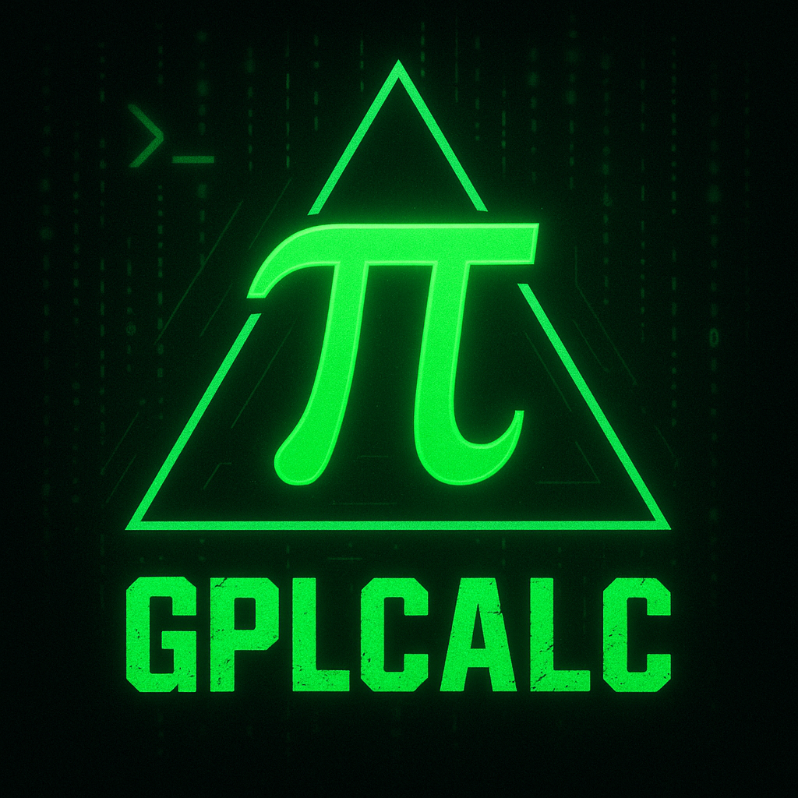

# gplcalc
This is a terminal based gpl calculator app.   
This CLI-based software supports:

- Basic arithmetic operations (+, −, ×, ÷)
- Square root calculation
- Exponentiation
- Hypotenuse Calculation
> **Not:** Türkçe versiyon için [buraya tıklayın](https://github.com/npc-gnu/gplcalc-tr)
 .

## Installation

### 1. Clone the repository:
`git clone https://github.com/npc-gnu/gplcalc.git && cd gplcalc`
### 2. Run the installer script:
`chmod +x installer && ./install`
### Or compile it like a gentoo-lover, cpu hater
`g++ -o gplcalc gplcalc.cpp` (then run the installer)

## Notes:
 Reason about the installer wants root, because of it copies gplcalc to /usr/local/bin and this operate needs root.
 This app uses cmath and iostream libraries.
 Fully written in C++ and written with vim, g++, Arch GNU/Linux ,kitty terminal.

## License:

This app and every part of it licensed by GNU is Not Unix Affero General Public Lisence version 3. (GPLv3)
